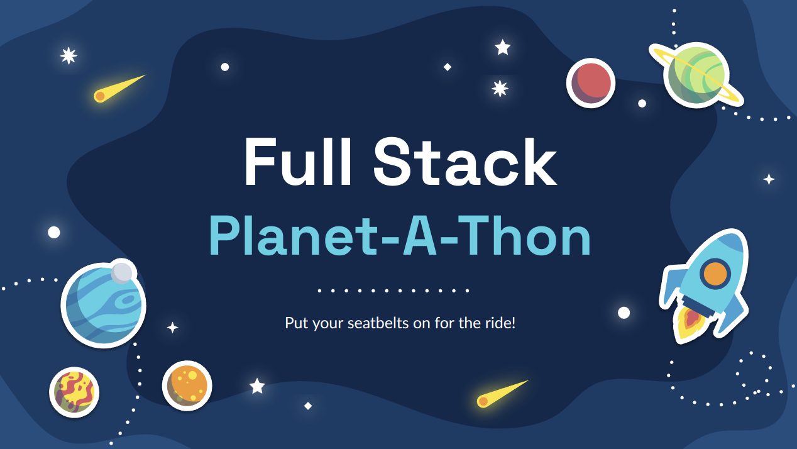

### In collaboration with [The American College of Thessaloniki](http://act.edu/)
### [Join the Discord](https://discord.gg/MpuzxRHVbz)
### [View the Workshop Presentation](https://docs.google.com/presentation/d/1cijUtaJo4YGXSEYCrH1BWgF54sWfr6x8f1FWIp-RzTs/edit?usp=sharing)

# Planet-A-Thon

As a parallel developer and student, I believe that the academic world and software development industry don't see eye-to-eye on many aspects. Hence, I created this repository and workshop as a safe space for my colleagues to experience the production world without compromises _(and without pressure!)_.

## Repository Content

- **Assets:** Images necessary for this README.
- **Backend:** Contains a Spring Boot & Kotlin application, complete with a `docker-compose.yml` and `Dockerfile` for deployment.
- **Mobile:** A Jetpack Compose project that calls some of the API endpoints exposed by the Backend application.

**You may find a more extensive description of each project in the README-s inside each directory.**

## Purpose & Goals
The scope of this project is to provide participants with a comprehensive learning experience in **full-stack application development and deployment**.

The workshop will cover various topics, including frontend and backend development using **Kotlin**, **Jetpack Compose** and **Spring frameworks**. Participants will also learn how to use **Git version control** to manage their code and create **a pipeline** to deploy their dockerized application in a server.